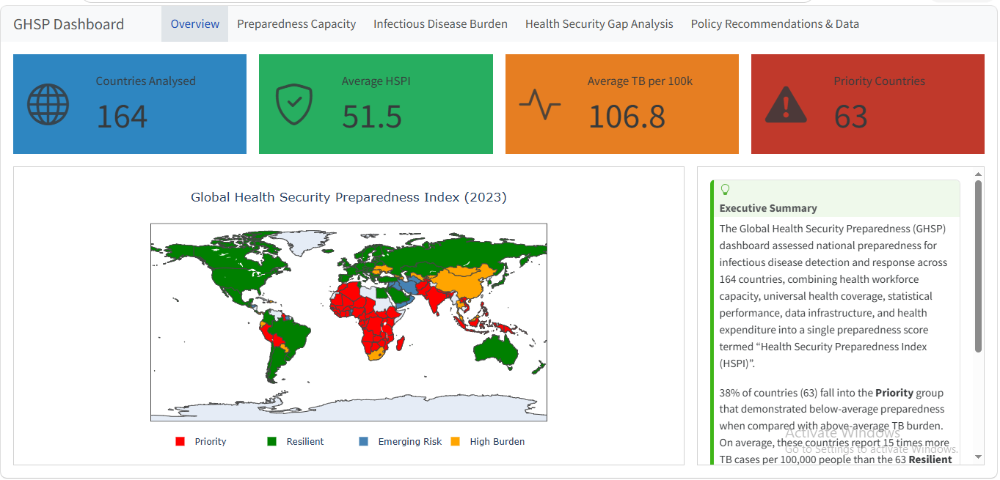

# Global Health Security Preparedness (GHSP) Dashboard



An interactive Quarto dashboard exploring how national health-system capacity relates
to infectious disease burden, using a composite **Health Security Preparedness Index
(HSPI)** built from World Bank / Gapminder indicators.

**Live dashboard:** `<https://chijiokeuhegwu.github.io/Global_Health_Security_Preparedness/>`
---

## 1. Motivation

Biological risk isn't only about whether a disease is present in a country, it's about
whether that country's health system can detect and respond to it. This project treats
tuberculosis incidence as a proxy for infectious disease burden and asks: which countries
combine **high disease burden with low preparedness**, and are therefore priorities for
surveillance and health-system investment? This framing connects directly to health
security and biosecurity — the practical ability of a state to detect and respond to a
biological event, whether natural, accidental, or deliberate.

## 2. Data sources

All indicators are pulled from Gapminder / World Bank Statistical Performance Indicators
and World Development Indicators.

| Variable | Indicator | Source code |
|---|---|---|
| `physicians` | Physicians per 1,000 population | `sh_med_phys_zs` |
| `uhc` | UHC service coverage sub-index, infectious diseases | `sh_uhc_sci_id` |
| `spi_overall` | Statistical Performance Indicators — Overall score | `iq_spi_ovrl` |
| `spi_pillar5` | SPI — Pillar 5, data infrastructure | `iq_spi_pil5` |
| `tb_incidence` | TB incidence, all forms, per 100,000 (estimated) | `all_forms_of_tb_incidence_per_100000_estimated` |
| `health_expenditure` | Current health expenditure (% of GDP) | `sh_xpd_chex_gd_zs` |

Raw CSVs are stored under `data/` in Gapminder's native wide (year-as-column) format.

## 3. Methodology

1. **Tidy** — each dataset is melted from wide to long format (`country`, `year`, value).
2. **Filter** — restricted to year ≥ 2000.
3. **Merge** — all six indicators outer-joined on `country_code` + `year`.
4. **Handle missingness** —
   - TB incidence (the outcome variable) is fixed at **2023** only, since it changes
     meaningfully year to year and mixing years would distort the burden comparison.
   - The five preparedness indicators use a **Most Recent Available Value (MRAV)**
     approach: for each country, the latest non-missing value between 2020–2023 is
     taken. This accounts for reporting lags in slower-moving structural indicators
     (e.g. SPI, physician density) without discarding countries that simply reported
     in an earlier year within the window.
5. **Composite index (HSPI)** — z-score normalize physicians, UHC, SPI overall, SPI
   Pillar 5, and health expenditure; average the z-scores; rescale to 0–100.
6. **Quadrant classification** — countries are split on the median HSPI and median
   TB incidence into four groups: *Priority* (low HSPI, high TB), *High Burden* (high
   HSPI, high TB), *Emerging Risk* (low HSPI, low TB), *Resilient* (high HSPI, low TB).

## 4. Repository structure

```
.
├── data/
│   ├── sh_med_phys_zs.csv
│   ├── sh_uhc_sci_id.csv
│   ├── iq_spi_pil5.csv
│   ├── iq_spi_ovrl.csv
│   ├── all_forms_of_tb_incidence_per_100000_estimated.csv
│   ├── sh_xpd_chex_gd_zs.csv
│   ├── analysis_full.csv        # generated: cleaned merged panel
│   └── analysis_hspi.csv        # generated: panel + HSPI + quadrants
├── index.qmd            # dashboard source
├── index.html            # dashboard view link
├── requirements.txt
└── README.md
```

## 5. Reproducibility

### Environment

```bash
python -m venv .venv
source .venv/bin/activate      # Windows: .venv\Scripts\activate
pip install -r requirements.txt
```

`requirements.txt`:
```
pandas
numpy
scipy
plotly
itables
```

You'll also need [Quarto](https://quarto.org/docs/get-started/) installed (CLI, not just
the Python package).

### Run locally

```bash
quarto preview index.qmd
```

This renders the dashboard and opens it in a browser with live reload.

### Render a static build

```bash
quarto render index.qmd
```

Output is written to `index.html` which can be deployed to a GitHub page.


## 6. Limitations

- HSPI is a composite index created for this analysis; it is not a validated,
  peer-reviewed measure and should not be treated as equivalent to established indices
  such as the Global Health Security (GHS) Index.
- Preparedness indicators use the most recent available value in a 2020–2023 window,
  which mixes reporting years across countries.
- TB incidence is used as a single proxy for infectious disease burden; it does not
  capture the full range of biological threats relevant to health security.
- The analysis is descriptive and intended to support exploratory comparison rather than establish causal relationships.

## 7. Attribution

This project was developed as a final submission for the Global Research and Analyses for Public Health (GRAPH) Python for Data Analysis course, where I was sponsored by UNODA's Biological Weapons Convention Programme. 
Data: World Bank Statistical Performance Indicators and World Development Indicators,
via Gapminder. 

Questions, feedback, or collaboration inquiries: **<chijiokeuhegwu@gmail.com>**

